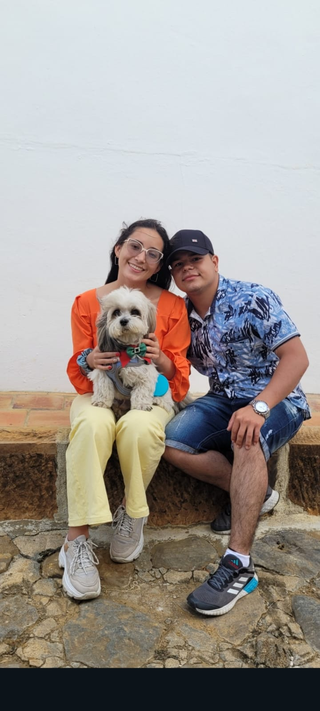
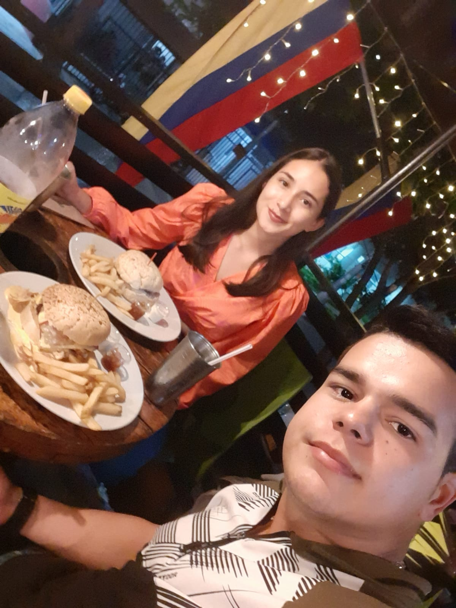

<!DOCTYPE html>
<html lang="es">
<head>
  <meta charset="UTF-8">
  <meta name="viewport" content="width=device-width, initial-scale=1.0">
  <title>Para Mi Reina</title>
  
</head>
<body>
  

    <h2>Buenos días mi reina linda 💖</h2>
    
Espero te encuentres súper bien. Pasaba por acá a desearte un gran día y a decirte algo bonito...

    
    
Ingresa una clave especial para continuar:

    <input type="password" id="clave" placeholder="DD/MM/AAAA">
     
    <button onclick="verificarClave()">Continuar</button>
  

  

    
    

      Amorcito mío, quiero recordarte que hoy hace 7 años dimos el paso más lindo de ser novios y un gran equipo. 💑  
      Por este motivo quiero que lo celebremos de una manera bonita: 
      <strong>Ir a cenar juntos</strong>, compartir en un restaurante lindo.  
      Alístate mi reina hermosa, <strong>te recojo hoy 11/05/2025 a las 7PM</strong>. 
      ¡Ponte súper linda! 💕
    

  

  
</body>
</html>
